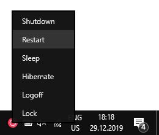
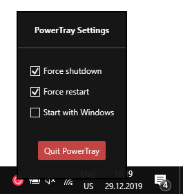

# PowerTray v1.0
 
PowerTray is a small tray app that forces Windows to shutdown without prompting user with "Are you sure?" message. 
 
<a href="https://github.com/DenisLjubarets/PowerTray/blob/master/Files/PowerTray.zip"><b>>> Download <<</b></a> 
 

&nbsp;&nbsp;&nbsp;&nbsp;&nbsp;&nbsp;

 
<a href="https://github.com/DenisLjubarets/PowerTray/blob/master/Files/PowerTray.zip"><b>>> Download <<</b></a> 
 

Icons made by <a href="https://www.flaticon.com/authors/freepik" title="Freepik">Freepik</a> from <a href="https://www.flaticon.com/" title="Flaticon">www.flaticon.com</a>

